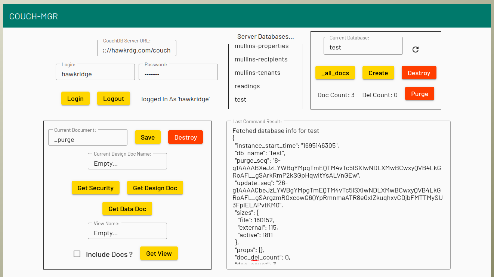
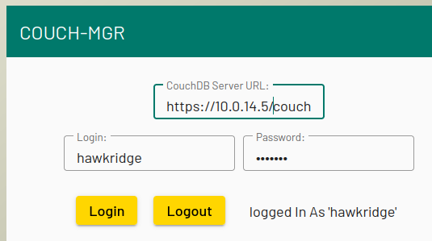
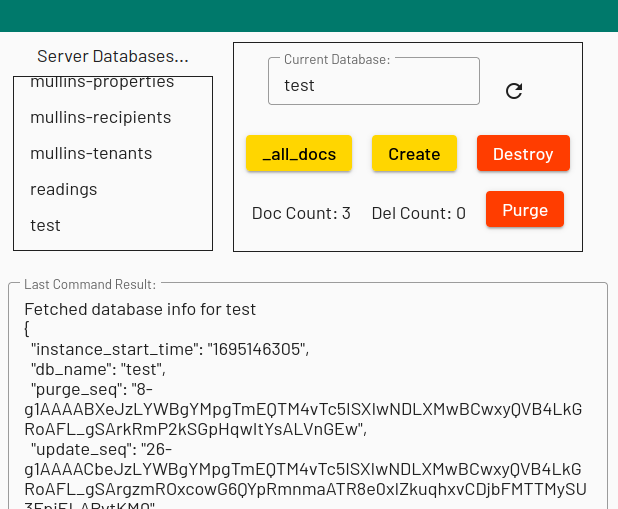
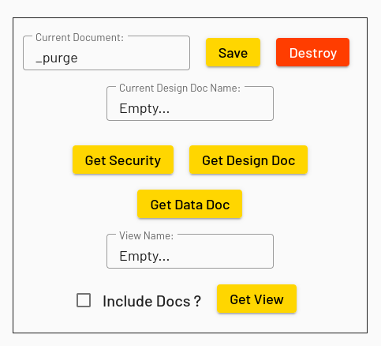
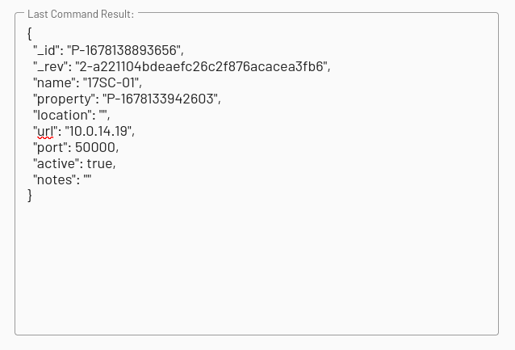

# COUCH-MGR
## A Simple and Basic Management Tool For CouchDB Databases...

## Built with Angular & Angular-Material...

## Why this tool

I am an Angular developer and mostly do data-driven apps. I prefer CouchDB as a backend and have an Angular DB service as a bridge that talks to a CouchDB server. Almost all the servers I work with are Express servers and I have couch securely proxied through them so that 127.0.0.1:5984 is only visible on the local net. 

I very much like CouchDB as a backend BUT have had no luck getting Fauxton to work through the proxies (and I have tried compiling work-arounds with no luck). Also Fauxton is a little klunky to me. This tool grew out of needing remote access to CouchDB servers running behind proxies. It allows me to do most everything I need managment-wise, including dealing with the _user database. Anyone who works with CouchDB should have no trouble with this tool, although it does require careful editing.

My Angular dev environment is multi-project so anyone wanting to build or modify this as a stand-alone app may need to do some adjusting of angular.json, otherwise, cloning into an appropriate folder should work...

## What this tool can do:

- Log in to any CouchDB server - not much functionality unless you login as a system admin...
- Get a list of databases, create new databases, destroy existing databases...
- Select a database to work with...
- Fetch and edit the currentDb/_security document...
- Fetch, edit, create, destroy design documents for the currentDb - currentDb/_design/designdocname...
- Fetch, edit, create, destroy an individual document by _id...
- Fetch a view: either bare or just the documents (include_docs is checked)...

## What this tool cannot do:

- Deal with attachments (although I may add this in the future)...
- Manage partitioning (although I may add this in the future)...
- Manage replication (although I may add this in the future)...
- Work with 'changes' feeds (although I access this for purging deleted docs)...
- Deal with Mango queries...

## Connecting:

Just provide a server URL, admin name and password...

## Managing databases:

Here you have a list of existing server databases. Clicking on one will fetch basic info. You can also type in a name and create a new database or you can destory a database or purge deleted docs.

## The Main Controls:

Here you can fetch and edit the security doc, fetch, edit, create, and destroy design docs, fetch, edit, create, and destroy plain docs. You can also fetch views if you have a view design doc - either the bare document metadata or the docs themselves (just check 'Include Docs').

## The Output Window:

The output window displays the results of the last command, the display being just a plain document. All the data is JSON and is, for the most part, editable. Here you can change plain docs, design docs, security. You can also just type in some JSON and create new plain docs and design docs - the JSON and CouchDB data has to be proper though.

This tool has helped me with managing my proxied servers without either travelling on-site or fiddling with the bind-address. I hope this may be userful to other developers. I would appreciate feedback, especially if any issues arise. You can try it out at:

    https://hawkrdg.com/couch-mgr

